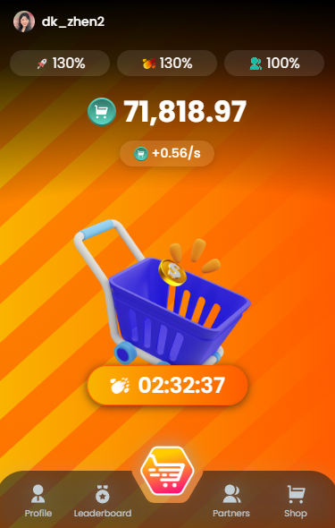

# Gumart-bot

gumart-bot is a Telegram automation tool designed to help you manage and interact with [gumart bot](https://t.me/gumart_bot/join?startapp=1370196228).

<p align="center">
  
</p>

### Features

- Auto claim farming rewards
- support multi account

### How to use

you can clone repository and add your token query

- Clone repository

```bash
git clone https://github.com/dkzhen/gumart-bot.git
```

- add config.json on folder configs

```json
[
  {
    "token": "query_id=AAFKwhUiAAAA.."
  }
]
```

- install modules

```bash
npm install
```

- running script

```bash
npm run start
```

[ WARNING ] this bot in development stage, if bot error you can try again. some error or bug will be fixed.

### Token Query

You can found on inspact element [F12] from telegram web. open the bot and see [ `on application - session storage -__telegram__initParams - tgWebAppData ` ]

- `query_id=AAFKwhUiAAAA`

- example query

```json
"query_id=AAFKwhUiAAAAAErCFSIcPoUl&user=%7B%22id%22%3A571851338%2C%22first_name%22%3A%22%21Zhen%20%7C%20RG%22%2C%22last_name%22%3A%22%22%2C%22username%22%3A%22dk_zhen%22%2C%22language_code%22%3A%22en%22%2C%22allows_write_to_pm%22%3Atrue%7D&auth_date=1721993224&hash=b5b6ea6964dbd45604d1eb29b1498df6d24b6a6c0a5f1bddf05684d7"
```

### Contact

You can contact me for more information or report an issue.

- [GitHub](https://github.com/dkzhen)

- [Telegram](https://t.me/dk_zhen2)
